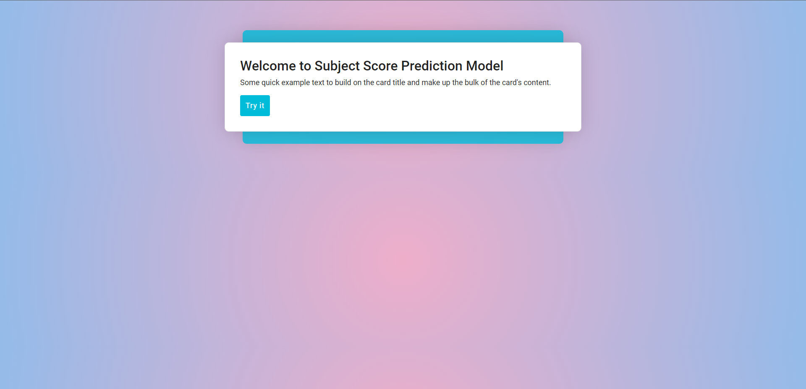
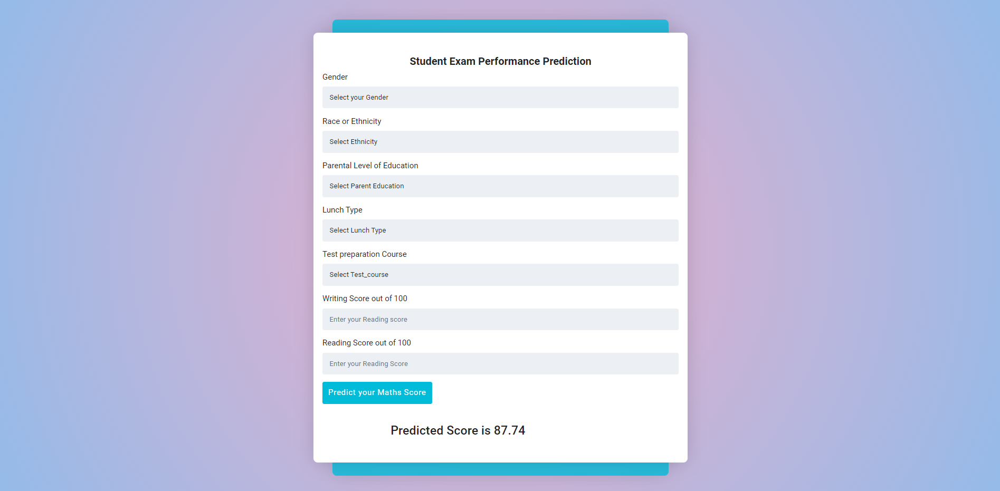

Student's Subject Score Prediction 
======================
This repository contains the code for my ML project. The project aims to predict the suject score  of a student given its features.

#### Project Preview

#### Project Dependencies
To get started, you will need to install the following dependencies:

- Python 3.6+
- NumPy
- Pandas
- matplotlib
- scikit-learn
- catboost
- xgboost
- Flask
- dill 

`/requirements.txt` includes all the necessary dependecy. to install run `python install -r requirements.txt` from main dir

#### Project Code
`/app.py` this is main executable file for the project  
`/setup.py` this file setups the project enviornment  
`src/exception.py` All exception handling function includes here  
`src/utils.py` All utility function includes here  
`src/logger.py` All log function includes here  
`/artifacts/` This folder includes all dataset and model pickle files 
`/notebooks/` This folder includes all the EDA notebooks

All data preparation code is located in `src` folder.  
- `src/components/data_ingestion.py` this file reads the sample dataset & split training and test dataset.  
- `src/components/model_trainer.py` this file evaluate the model preformance based on test and train data and selects the best model to predicts.  
- `src/components/data_transformation.py` this file transform the user input dataform and ready the dataset for model prediction.  

All model pipeline code is located in `pipeline` folder. 
- `pipeline/predict_pipeline.py` this file delivers the user input data to model 

#### Run Project
> - To run project first clone the project from repository using  
`https://github.com/salmansrizon/mlproject.git`
> - after clonning need to run from cmd `python setup.py` to create the enviornment. 
> - finaly `python app.py` run the project. 

#### Future development
- Develop more functionality and UI features
- Create a docker image and upload to `hugggingface space`

#### Conclusion
The main intention of this project is to get experineces how an end to end ml project needs to created following the standers mlops procedure. I took inspiration and help from [Krish Naik's](https://www.youtube.com/@krishnaik06 "Krish Naik") [End to End ml project development playlist](https://www.youtube.com/watch?v=S_F_c9e2bz4&list=PLZoTAELRMXVPS-dOaVbAux22vzqdgoGhG&ab_channel=KrishNaik).  
 

